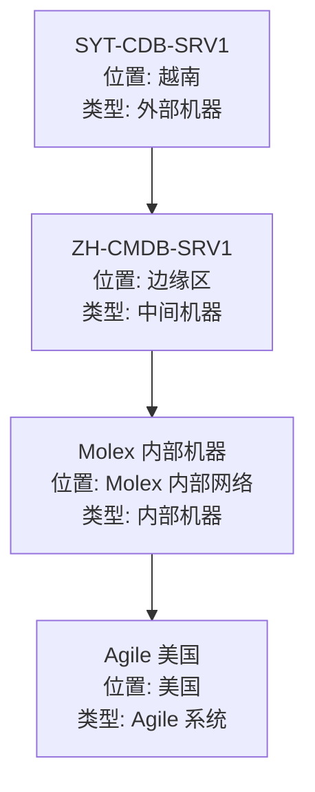

```mermaid
graph TD
    A[SYT-CDB-SRV1<br>位置: 越南<br>类型: 外部机器] --> B[ZH-CMDB-SRV1<br>位置: 边缘区<br>类型: 中间机器]
    B --> C[Molex 内部机器<br>位置: Molex 内部网络<br>类型: 内部机器]
    C --> D[Agile 美国<br>位置: 美国<br>类型: Agile 系统]


```