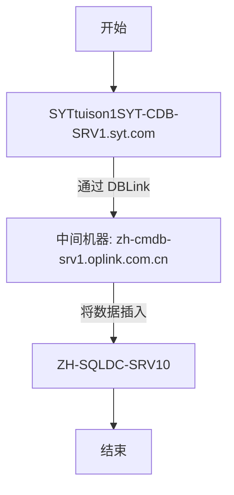

```mermaid
graph TD
    G[开始] --> A
    A[SYTtuison1SYT-CDB-SRV1.syt.com] -->|通过 DBLink| C[ 中间机器: zh-cmdb-srv1.oplink.com.cn]
    %% B -->|通过 OpenQuery 查询| C[查询 SYT-CDB-SRV1.syt.com 的数据]
    C -->|将数据插入| E[ ZH-SQLDC-SRV10]
    E --> F[结束]

```