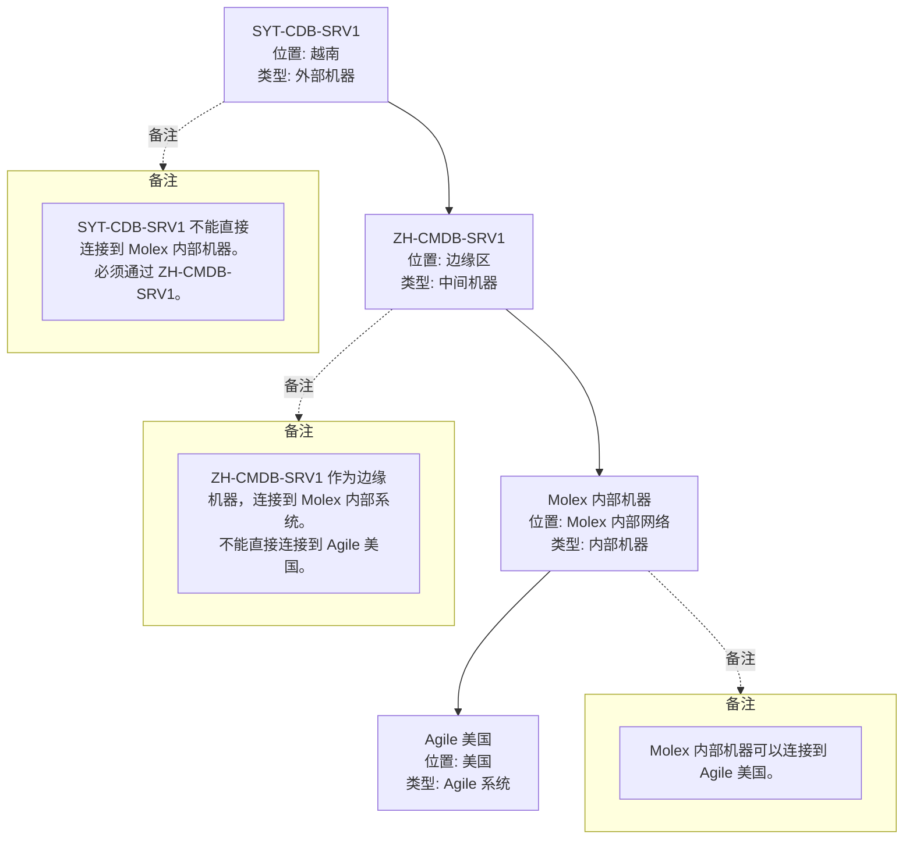

```mermaid
graph TD
    A[SYT-CDB-SRV1<br>位置: 越南<br>类型: 外部机器] --> B[ZH-CMDB-SRV1<br>位置: 边缘区<br>类型: 中间机器]
    B --> C[Molex 内部机器<br>位置: Molex 内部网络<br>类型: 内部机器]
    C --> D[Agile 美国<br>位置: 美国<br>类型: Agile 系统]

    subgraph Note1 [备注]
        direction LR
        A1[SYT-CDB-SRV1 不能直接连接到 Molex 内部机器。<br>必须通过 ZH-CMDB-SRV1。]
    end
    subgraph Note2 [备注]
        direction LR
        B1[ZH-CMDB-SRV1 作为边缘机器，连接到 Molex 内部系统。<br>不能直接连接到 Agile 美国。]
    end
    subgraph Note3 [备注]
        direction LR
        C1[Molex 内部机器可以连接到 Agile 美国。]
    end

    A -.->|备注| Note1
    B -.->|备注| Note2
    C -.->|备注| Note3
```